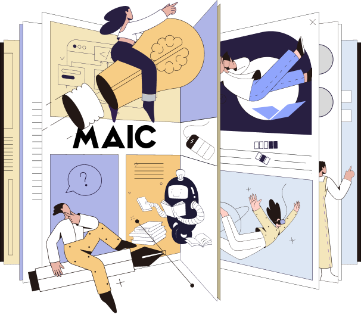

<div align="center">
</img> 

<strong>面向大模型时代在线教育的多智能体开放学习平台</strong> 

<strong>中文版 | [英文版](./README.md)</strong>

加入我们的<a href="docs/wechat.md" target="_blank"> 💬 微信群</a> | 查看 MAIC 的 <a href="https://arxiv.org/abs/2409.03512" target="_blank"> 📖 技术报告</a> </div>

MAIC（Massive AI-empowered Courses）旨在打造一个高度沉浸式且可配置的AI驱动学习课堂，基于大语言模型，并融合多种智能体如教师、助教和同伴。该系统旨在全程辅助学生的学习过程，支持教师智能备课，并为学生提供高水平的个性化学习体验，最终实现“自主课堂”的体验，让每个学生拥有专属的学习旅程。

**概念设计**：本项目的概念设计涵盖技术与教育两方面的理念：

* **技术理念**：项目致力于构建一个完全由多智能体系统和大语言模型驱动的智能课堂环境。目标是显著提升学生的沉浸式学习体验，同时进一步加强对教师在备课、授课及课后活动中的智能支持，从而推动智能学习环境的迭代进化。
* **教育理念**：利用大语言模型强大的泛化能力，项目旨在同时应对教育数字化中的“规模化”和“个性化”双重挑战，目标是引领新时代的数字教育范式转型，如同过去大规模课堂带来的变革一样。

## 最新动态 <!-- omit in toc -->

#### 📌 置顶

* [2025.01.23] 🚀🚀🚀 我们的课堂模拟论文已经被 NAACL 2025 接收！ 
* [2024.12.16] 🚀🚀🚀 我们的 Silde2Lecture 子系统论文已经被 KDD 2025 接收！ 
* [2024.12.5] 📚📚📚MAIC 的综合文档已发布：https://doc.maic.chat/ （详见下方申请部分）

## 演示与评估 <!-- omit in toc -->

关于我们最新研究和团队成员的更多信息，欢迎访问项目主页：https://project.maic.chat/

MAIC 简介演示视频：[观看视频](https://cloud.tsinghua.edu.cn/f/24c66e1318fc403e99d5/)

学术顾问演示视频：[观看视频](https://cloud.tsinghua.edu.cn/f/25f5416274cc410daf4a/)

## 模型许可与申请 <!-- omit in toc -->

* 本仓库基于 [Apache-2.0](https://github.com/OpenBMB/MiniCPM/blob/main/LICENSE) 协议发布。
* MAIC 的模型和平台完全免费提供给学术研究使用。在填写["问卷"](https://vd17d2kd0c.feishu.cn/share/base/form/shrcn2PmspMbOnXZi1hxbS5AA7d)后进行注册，您即可合作使用 MAIC 的源代码和文档。

## 声明 <!-- omit in toc -->

MAIC 通过学习大量的多模态语料生成内容，但无法理解、表达个人意见或作出价值判断。由 MAIC 智能体生成的任何内容不代表模型开发者的观点和立场。

我们对使用 MAIC 平台引发的任何问题概不负责，包括但不限于数据安全问题、舆论风险或因模型误导、误用、传播或滥用所引发的风险和问题。

## 🌟 Star 历史 <!-- omit in toc -->

<p align="center">    </p>

## 关键技术及其他相关项目 <!-- omit in toc -->

👏 欢迎探索 MAIC 的关键技术及我们团队的其他 AI4Edu 项目：

[MOOCCube](https://github.com/THU-KEG/MOOCCubeX?tab=readme-ov-file) | [MOOC-Radar](https://github.com/THU-KEG/MOOC-Radar) | [XDAI](https://github.com/THUDM/XDAI) 

## 引用 <!-- omit in toc -->

如果您发现我们的模型/代码/论文对您有帮助，请考虑引用我们的论文 📝 并为我们点赞 ⭐️！

```bib
@article{yu2024mooc,
  title={From mooc to maic: Reshaping online teaching and learning through llm-driven agents},
  author={Yu, Jifan and Zhang, Zheyuan and Zhang-li, Daniel and Tu, Shangqing and Hao, Zhanxin and Li, Rui Miao and Li, Haoxuan and Wang, Yuanchun and Li, Hanming and Gong, Linlu and others},
  journal={arXiv preprint arXiv:2409.03512},
  year={2024}
}
```

我们的教师端论文：

```
@article{zhang2024awaking,
  title={Awaking the Slides: A Tuning-free and Knowledge-regulated AI Tutoring System via Language Model Coordination},
  author={Zhang-Li, Daniel and Zhang, Zheyuan and Yu, Jifan and Yin, Joy Lim Jia and Tu, Shangqing and Gong, Linlu and Wang, Haohua and Liu, Zhiyuan and Liu, Huiqin and Hou, Lei and others},
  journal={arXiv preprint arXiv:2409.07372},
  year={2024}
}
```

我们的学生端论文：

```
@article{zhang2024simulating,
  title={Simulating classroom education with llm-empowered agents},
  author={Zhang, Zheyuan and Zhang-Li, Daniel and Yu, Jifan and Gong, Linlu and Zhou, Jinchang and Liu, Zhiyuan and Hou, Lei and Li, Juanzi},
  journal={arXiv preprint arXiv:2406.19226},
  year={2024}
}
```


##### 